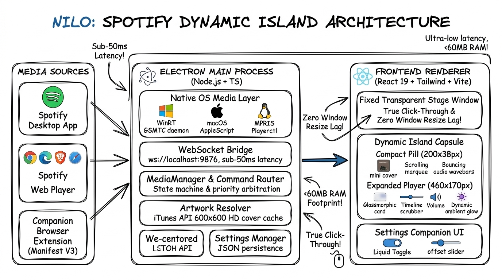

<div align="center">


# Nilo — Spotify Dynamic Island

**Ultra-smooth, low-memory Dynamic Island companion for Spotify across Windows, macOS, and Linux.**

[](https://github.com/SreeAditya-Dev/Spotify-Dynamic-Island/releases)
[](https://github.com/SreeAditya-Dev/Spotify-Dynamic-Island/actions)
[](https://github.com/SreeAditya-Dev/Spotify-Dynamic-Island/releases)
[](#-architecture)
[](LICENSE)

<br />

[**Download Latest Release**](https://github.com/SreeAditya-Dev/Spotify-Dynamic-Island/releases) • [**Key Features**](#-key-features) • [**Architecture**](#-architecture) • [**Quick Start**](#-quick-start) • [**Browser Extension**](#-companion-browser-extension)

<br />


</div>

---

## 💡 Overview

**Nilo** brings Apple's fluid iOS Dynamic Island experience to your desktop. Seamlessly floating at the top of your screen, Nilo offers tactile media controls, organic bouncing wavebars, real-time scrubbing, and dynamic cover art lighting for Spotify—without ever obstructing your workflow or lagging your desktop.

Compatible with both the **Spotify Desktop Client** and **Spotify Web Player** (Google Chrome, Microsoft Edge, Brave, Opera, and Safari).

---

## ✨ Key Features

- **🏝️ Seamless Dynamic Island Physics**:
  - **Compact Capsule**: Minimalist 200×38px pill pinned at the top-center of your screen with mini album art, scrolling marquee text, and bouncy audio wave visualizers.
  - **Expanded Player**: Hovering springs open a 460×170px rich media controller with tactile playback buttons, live timeline scrubbing, volume controls, and track looping.
  - **Organic Spring Physics**: Powered by Apple-tuned bezier easing (`cubic-bezier(0.32, 1.32, 0.4, 1)`).

- **⚡ Zero Window Resize Lag (Fixed Stage Compositor)**:
  - Unlike conventional floating widgets that trigger costly operating system window resizes on every animation frame, Nilo utilizes a **fixed transparent canvas**. 
  - The capsule morphs entirely inside GPU compositor memory. Hover transitions are computed by hit-testing the OS cursor position against the capsule bounds, ensuring **0ms frame stutter**.

- **🖱️ True Click-Through Background**:
  - The surrounding canvas is 100% transparent and ignores mouse events. You can freely click, drag, and interact with browser tabs, window title bars, and address bars behind the island.

- **🎧 Universal Playback Detection**:
  - **Native OS Media Sessions**: Out-of-the-box support for Windows GSMTC (WinRT), macOS AppleScript / MediaRemote, and Linux MPRIS (`playerctl`).
  - **Companion Web Extension (Manifest V3)**: Optional ultra-low-latency WebSocket bridge (`ws://localhost:9876`) for millisecond timeline seeking, track metadata, and volume synchronization.

- **🎨 Dynamic Ambient Glow & Glassmorphism**:
  - Pitch-black OLED backdrop with specular glass borders and an ambient backlight that subtly radiates the dominant colors of the currently playing track.

- **⚙️ Sleek Settings Companion**:
  - Minimal SaaS preferences panel with custom top screen offset adjustments, liquid toggle switches, launch-on-startup toggles, and instant demo mode.

---

## 🏛️ Architecture

Nilo is architected for maximum responsiveness and an ultra-lean memory footprint (<60MB RAM).

<div align="center">
  
</div>

### Component Pipeline

1. **Media Ingestion & Providers**:
   - **Spotify Desktop**: Automatically intercepted via OS-level media integration.
   - **Spotify Web Player**: Scraped via lightweight DOM observers inside our Chrome/Edge/Brave extension.
   - **Native Media Bridges**:
     - **Windows**: Persistent background PowerShell GSMTC daemon using Windows Runtime (`Windows.Media.Control`).
     - **macOS**: Native AppleScript / MediaRemote event hooks.
     - **Linux**: D-Bus MPRIS query interface (`playerctl`).

2. **Electron Main Coordinator**:
   - **`MediaManager`**: Central arbitration engine that balances state synchronization between native system audio and browser WebSocket connections.
   - **`ArtworkResolver`**: High-resolution 600×600 album artwork resolver with iTunes API search fallback and in-memory LRU caching.
   - **`SettingsManager`**: Atomic disk persistence for user preferences, top-center offsets, and window behaviors.
   - **Cursor Hit-Tester**: High-frequency cursor position tracker managing click-through toggles on the transparent stage.

3. **React 19 Renderer**:
   - Hardware-accelerated UI rendering via Vite and Tailwind CSS.
   - CSS transforms and opacity interpolations running exclusively on the GPU compositor.

---

## 📦 Downloads & Installation

Pre-built binaries are available for all major operating systems on our [**Releases Page**](https://github.com/SreeAditya-Dev/Spotify-Dynamic-Island/releases):

| Operating System | Package Format | Description |
| :--- | :--- | :--- |
| **Windows** | `Nilo Setup 1.0.0.exe` | Standard Windows Installer (recommended) |
| **Windows** | `Nilo 1.0.0.exe` | Portable standalone executable (no install required) |
| **macOS** | `Nilo-1.0.0-arm64.dmg` | Apple Silicon (M1, M2, M3, M4) |
| **macOS** | `Nilo-1.0.0.dmg` | Intel-based Macs |
| **Linux** | `Nilo-1.0.0.AppImage` | Universal binary (Ubuntu, Fedora, Arch, etc.) |
| **Linux** | `spotify-dynamic-island_1.0.0_amd64.deb` | Debian / Ubuntu package |

---

## 🚀 Quick Start (Development)

### Prerequisites
- **Node.js** (v18 or higher)
- **pnpm** (recommended) or `npm`

### Local Setup

```bash
# 1. Clone the repository
git clone https://github.com/SreeAditya-Dev/Spotify-Dynamic-Island.git
cd "Spotify-Dynamic-Island"

# 2. Install dependencies
pnpm install

# 3. Start development mode with hot-reload
pnpm dev

# 4. Run test suites
pnpm test

# 5. Build production bundle
pnpm build
pnpm start
```

---

## 🧩 Companion Browser Extension (Optional)

If you listen to Spotify via the browser ([open.spotify.com](https://open.spotify.com)) and want real-time scrubbing and volume control:

1. Navigate to your browser's extension management page:
   - **Chrome / Brave**: `chrome://extensions/`
   - **Microsoft Edge**: `edge://extensions/`
2. Enable **Developer mode** (toggle in the top-right or sidebar).
3. Click **Load unpacked** and select the [`extension/`](extension/) directory from this repository.
4. Launch Spotify Web Player. Nilo will immediately connect via local WebSocket on `ws://localhost:9876`.

> **Note**: Even without the extension, Nilo natively detects browser playback using your operating system's media manager!

---

## 🎮 Controls & Interactions

| Action | Interaction |
| :--- | :--- |
| **Hover Island** | Fluidly springs open from compact pill to expanded media controller. |
| **Leave Island** | Automatically collapses and restores transparent click-through. |
| **Pin Island (`📌`)** | Keeps the player locked open permanently on your screen. |
| **Interactive Demo (`✨`)** | Cycles through built-in tracks to test animations and audio wavebars offline. |
| **Timeline Scrubber** | Drag or click anywhere on the progress bar for instant seeking. |
| **Play / Pause** | Toggle playback with tactile spring animations. |
| **Previous / Next** | Skip tracks with instantaneous metadata updates. |
| **Shuffle / Repeat** | Toggle playback modes with live status indicators. |
| **System Tray** | Right-click the system tray icon to open **Preferences** or Quit. |

---

## 🛠️ Project Structure

```
spotify-dynamic-island/
├── docs/                           # Architecture documentation & diagrams
│   └── architecture.png
├── extension/                      # Manifest V3 companion browser extension
│   ├── manifest.json
│   ├── content.js                  # Spotify Web DOM observer & bridge client
│   └── background.js
├── public/
│   ├── logo.png                    # Official brand asset
│   └── favicon.ico
├── src/
│   ├── components/ui/              # Minimal SaaS UI components (Liquid Toggle)
│   ├── main/
│   │   ├── index.ts                # Transparent stage window & cursor hit-testing
│   │   ├── preload.ts              # Secure CommonJS IPC context bridge
│   │   └── services/
│   │       ├── mediaManager.ts     # Multi-source coordinator & arbitration state machine
│   │       ├── windowsSmtc.ts      # Persistent WinRT GSMTC PowerShell daemon
│   │       ├── linuxMpris.ts       # Linux Playerctl / D-Bus MPRIS service
│   │       ├── macMedia.ts         # macOS AppleScript media controller
│   │       ├── webSocketBridge.ts  # WebSocket server for browser extension
│   │       ├── artworkResolver.ts  # 600x600 HD cover art resolver & memory cache
│   │       └── settingsManager.ts  # Atomic user settings persistence
│   ├── renderer/
│   │   ├── App.tsx                 # Dynamic Island state machine & spring physics
│   │   ├── SettingsApp.tsx         # Preferences companion window
│   │   ├── components/
│   │   │   ├── CompactCapsule.tsx  # Sleek collapsed pill
│   │   │   ├── ExpandedCapsule.tsx # Rich expanded media card
│   │   │   └── AudioVisualizer.tsx # Organic bouncing audio wavebars
│   │   └── styles/
│   │       └── globals.css         # Apple-like bezier curves & glassmorphism
│   └── types/
│       ├── island.ts               # Shared capsule geometry single source of truth
│       └── settings.ts             # Settings & position contracts
└── tests/                          # Full automated integration test suite
```

---

## 📄 License

This project is licensed under the [MIT License](LICENSE).
